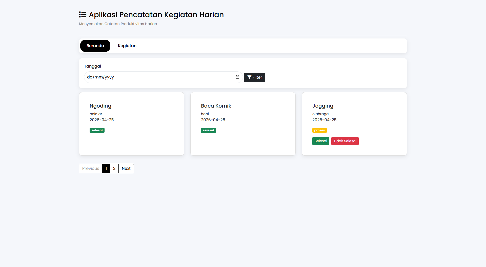

# Aplikasi Pencatatan Kegiatan Harian / To Do List

**To Do List** adalah sistem aplikasi yang saya buat untuk kegiatan harian  
supaya kita bisa tau daftar kegiatan apa saja yang mau kita lakukan pada hari itu.




## Alat 
- **Code Editor** : Visual Studio Code
- **PHP** : PHP 8.2
- **DBMS** : XAMPP atau Laragon

## Instalasi 
1. **Nyalakan Server dan My SQL pada DBMD**
2. **Clone Repository / Download ZIP**
   ```bash
     git clone https://github.com/KuchAli/ToDoList.git
     cd ToDoList
   ```
3. **Buat Databse Baru  
   dengan nama todolist_db lalu import file
   todolist_db.sql**
4. **Jalankan Aplikasi**  
   localhost/todolist/index.php

## Lisensi

Program ini dibuat Oleh  :  **MisterK**
   
